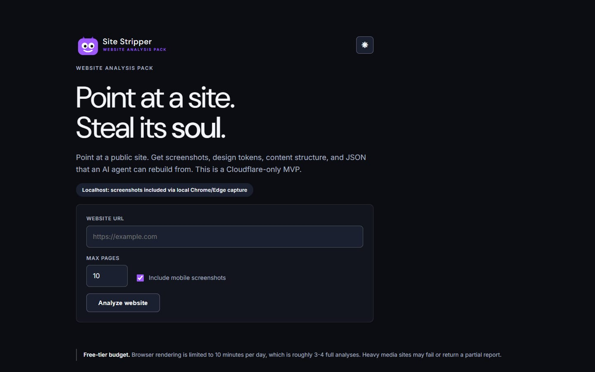
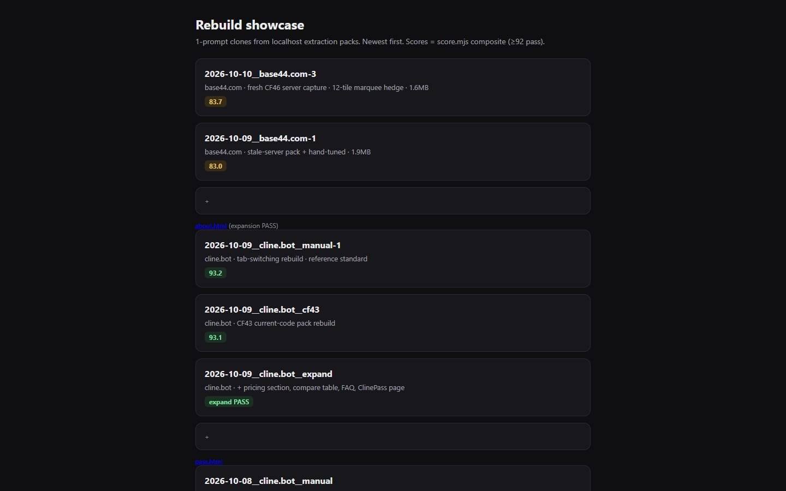
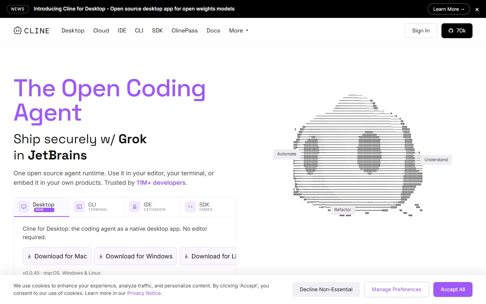
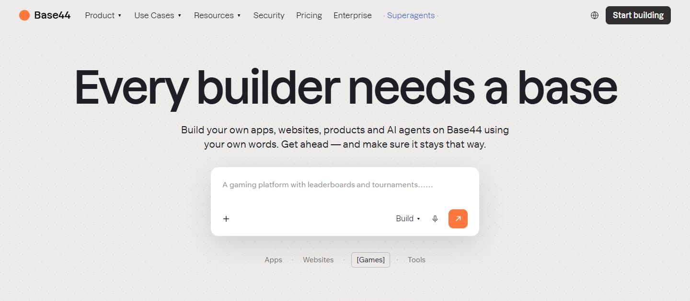
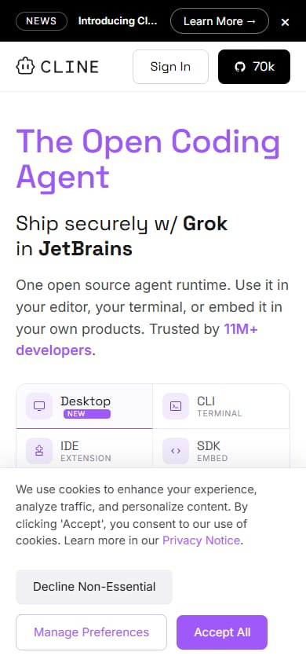

# Site Stripper — Website Analysis Pack

An AI-ready website-analysis pack generator. Point at a public URL and get screenshots, design tokens, content guidance, responsive behavior, interaction notes, Markdown documentation, and JSON data — everything an AI coding agent needs to rebuild a site at 80–90%+ fidelity (93+ measured on clean content sites, 1 prompt).

Cloudflare Pages + Workers on the **Free tier only**. No VPS, Docker, external browser service, database, or AI API in production.

## Screenshots

| | |
|---|---|
|  |  |
| **The app** (`localhost:8917`): paste a URL, get a ZIP pack. | **The proof** ([gallery](https://site-stripper-tests.pages.dev)): 15 one-prompt rebuilds with scores. |
|  |  |
| **cline.bot clone — 93.2** ([live](https://site-stripper-tests.pages.dev/2026-10-09__cline.bot__manual-1/)): tab-switching hero, cookie bar, hover states. | **base44.com clone — 83.7** ([live](https://site-stripper-tests.pages.dev/2026-10-10__base44.com-3/)): dotted paper, prompt box, marquee hedge. |
|  | |
| **Mobile 390 px**: fluid reflow, natural wraps, no desktop constraints. | |

## How it works

```text
Static UI (web/) ──POST /api/analyze──▶ Worker API ──▶ Browser Rendering (Chromium)
        │                                       │  one session, sequential tabs,
        │                                       ▼  close each tab immediately
        │                          Bounded versioned observations (no docs, no ZIP)
        ▼
Browser renders Markdown/JSON/theme files, validates the package,
assembles a STORE ZIP client-side, triggers download
```

Heavy work runs inside Chromium (`page.evaluate`) or the client — never in Worker JavaScript (10 ms CPU budget). The Worker validates, sequences, and passes observations through.

## Quickstart (local)

Requires Node ≥ 20 and an installed Chrome/Edge.

```sh
npm install
npm run dev -w worker        # served UI + API on http://localhost:8787
```

Or on the standing local port with auto-restart:

```sh
./start-server.bat           # http://localhost:8917
```

Analyze a site from the form (up to 10 pages), inspect screenshots and raw JSON, then download the ZIP.

## Commands

```sh
npm run typecheck -w worker  # tsc --noEmit, must be clean
npm test -w worker           # vitest, 386 tests across 27 files (run one file at a time; full suite OOMs)
npm run dev:remote -w worker # local code vs remote Cloudflare resources (hosted verification)
npm run deploy -w worker     # deploy the Worker API (manual fallback)
npm run deploy:ui            # deploy the Pages UI (manual fallback)
```

## Deployments — every URL, what it's for, how it ships

Three Cloudflare targets, two local modes. Same wrangler, different commands:

| URL | What | Project / name | How it deploys |
|---|---|---|---|
| `https://site-stripper-ui.pages.dev` | **Production app** (the form + ZIP download) | Pages `site-stripper-ui` | CI on push to `master` (gated) |
| `https://site-stripper-api.momo00roro.workers.dev` | **Production API** (`POST /api/analyze`, `/health`) | Worker `site-stripper-api` | CI on push to `master` (gated) |
| `https://site-stripper-tests.pages.dev` | **Rebuild gallery** (15 one-prompt clones + scores, nothing else) | Pages `site-stripper-tests` | Manual direct upload (never CI) |
| `https://<hash>.site-stripper-ui.pages.dev` | **Preview snapshots** (one deploy frozen in time — not production) | Pages `site-stripper-ui` | Every CI deploy also leaves one |
| `http://localhost:8917` | **Local full capture** (unlimited, heaviest fidelity track) | `start-server.bat` → `tsx worker/local/server.ts` | Local process, restart after worker edits |
| `http://localhost:8787` | **Local wrangler dev** (hosted-parity check) | `npm run dev -w worker` | `wrangler dev` / `dev:remote` |

### Target 1 — Production UI (`site-stripper-ui.pages.dev`)

The face. Static files from `web/` (form, results, client-side ZIP assembly).
The UI's `<meta name="api-base">` in `web/index.html` points at the Worker
URL (same-origin does not apply once UI and API live on different domains).

- CI: `npx wrangler pages deploy web --project-name site-stripper-ui --branch ${{ github.ref_name }}`
  — `--branch master` is what promotes the upload to **production** instead of
  a preview. Without it, CI's detached HEAD produces preview-only deploys and
  production keeps serving stale HTML.
- Manual fallback: `npm run deploy:ui` (repo root; no `--branch` → preview URL only).

### Target 2 — Production API (`site-stripper-api…workers.dev`)

The brain. `worker/src/index.ts` via `worker/wrangler.jsonc`
(`name: site-stripper-api`, `nodejs_compat`, `BROWSER` binding for Browser
Rendering, `ENVIRONMENT`/`ALLOWED_ORIGINS` vars). Validates, sequences, and
passes bounded observations through — never Markdown/ZIP/image work in Worker
JS (10 ms CPU budget).

- CI: `npx wrangler deploy` with `working-directory: worker` (reads
  `wrangler.jsonc` there).
- Manual fallback: `npm run deploy:api` (→ `npm run deploy -w worker`).
- Health: `/health` reports `schemaVersion`; logs via
  `npx --prefix worker wrangler tail`.

### Target 3 — Rebuild gallery (`site-stripper-tests.pages.dev`)

The proof. Static exports of the best 1-prompt rebuilds (`showcase/`, 15
dirs + `index.html` scoreboard). A **separate Pages project on purpose**: the
main root stays the product, the gallery stays a gallery, and pushing product
code never redeploys (or wipes) the clones.

- Manual only (deliberately NOT in CI):
  `npx wrangler pages deploy showcase --project-name site-stripper-tests`
  from the repo root. Run it after adding new rebuilds to `showcase/`.
- No `--branch` flag → each upload becomes the production of *that* project.
- Per-deployment preview URLs (`https://<hash>.site-stripper-tests.pages.dev`)
  work the same as the UI project's.

### Preview URLs (both Pages projects)

Every `wrangler pages deploy` prints a `https://<hash>.<project>.pages.dev`
URL. Those are snapshots of one deploy, not production — always verify
against the canonical `site-stripper-ui.pages.dev` /
`site-stripper-tests.pages.dev` domains.

### Why GitHub Actions instead of Cloudflare's "Connect Git repository" button?

Both paths ship the same files. The difference is who runs the checks and how
many deployers exist:

- **GitHub Actions (what we use):** every push runs `typecheck` + the full
  386-test suite first; a red suite blocks the deploy. One deployer (repo-pinned
  Wrangler v4 on Node 22 via `npx`, in CI) pushes both the Worker and the Pages
  UI, including the `--branch master` flag so the upload promotes the
  production environment instead of a preview. Secrets live only as GitHub
  Actions secrets (`CLOUDFLARE_API_TOKEN` / `CLOUDFLARE_ACCOUNT_ID`); values are
  never committed. Pushes to `master` deploy automatically via
  `.github/workflows/deploy.yml` (also runnable by hand under the repo's
  **Actions** tab). The gallery project is never touched by CI.
- **Cloudflare Git integration (deliberately NOT connected):** Cloudflare would
  auto-build on every push with no typecheck/test gate, using its own Wrangler
  version and Pages build settings instead of ours. Running both at once means
  two deployers race for production. That is why Settings → Build → Git
  repository is intentionally left empty (Direct Upload via CI only).

ELI10: connecting the repo in Cloudflare's dashboard is like giving the printer
its own "print every draft" button — it skips the teacher checking your homework
(typecheck + tests) and two printers fight over the same paper. GitHub Actions
is the one printer that only prints after homework passes.

### ELI10: the whole deployment, in 5 lines

1. You `git push` your homework to GitHub.
2. A robot (Actions) checks it: spelling (typecheck), then all 386 quiz answers (tests).
3. Fail = stop, nothing ships. Pass = keep going.
4. Robot mails the brain (Worker API) then the face (Pages UI) to Cloudflare's computers.
5. Your site updates at `site-stripper-ui.pages.dev`, talking to the brain at
   `site-stripper-api.momo00roro.workers.dev`. (The gallery updates only when
   a human runs the showcase upload.)

### One-time setup (already done — recorded here, never edit secrets in code)

1. `npx wrangler login`, then `npx wrangler whoami` to confirm the account.
2. First-time Pages projects (Worker needs no pre-creation):
   `npx wrangler pages project create site-stripper-ui --production-branch master`
   and `npx wrangler pages project create site-stripper-tests --production-branch master`
   (CI uses repo-pinned Wrangler v4 on Node 22 — not
   `cloudflare/wrangler-action`, which ships a stale v3).
3. GitHub repo → Settings → Secrets and variables → Actions — two secrets
   (names are case-sensitive; values are never committed):
   - `CLOUDFLARE_ACCOUNT_ID` — from Workers & Pages Overview in dash.cloudflare.com
   - `CLOUDFLARE_API_TOKEN` — custom token with **Account | Workers Scripts | Edit**
     and **Account | Cloudflare Pages | Edit** (minted once under My Profile → API Tokens)

### Useful terminal commands

```sh
git push origin master                    # deploy UI+API (triggers CI)
npx wrangler pages deploy showcase --project-name site-stripper-tests  # update the gallery (manual)
npx wrangler whoami                       # confirm Cloudflare identity
npx --prefix worker wrangler tail         # live Worker logs (repo root)
npx wrangler pages deployment list --project-name site-stripper-ui     # deploy history + preview hashes
```

Monitor browser-minute usage at dash.cloudflare.com → **Compute → Browser Run**
(free quota: 10 min/day, hard stop with 429s; quota resets daily at 00:00 UTC = 08:00 Singapore).

## Output package

```text
website-analysis/
  README.md  website-overview.md  information-architecture.md
  design-tokens.md  typography.md  content-style.md  design-system.md
  imagery-and-video.md  motion-and-interactions.md
  responsive-behavior.md  implementation-plan.md  REBUILD.md
  pages/*.md  screenshots/{desktop,mobile,sections}/
  data/{pages,tokens,layout,components,navigation,interactions,assets,selection,responsive-pairs,report}.json
  theme.css  theme.v2.css  tailwind.config.js  tailwind.theme.mjs  fonts.css  assets/
```

`data/pages.json` is canonical. Every Markdown file is a projection of the same bounded observations — never a second source. Each value carries source/confidence (`observed` / `inferred` / `unknown`), every capped collection reports source/emitted/cap/truncation, and gaps (bot challenges, video regions, pin scenes, pruned fields) are explicit limitations, not silent omissions.

## Key limits (Free-tier driven)

| Limit | Value |
|---|---|
| Pages per analysis | 10 max (homepage + 9) |
| Per-page extraction payload | 512 KB hard / 350 KB warn |
| Screenshots | 10 desktop, 2 mobile, 6 homepage sections; 10 MB total |
| Video shots | 12 max (`maxVideoShots`): autoplay-first, isolated motion-polled render, streamless-only click fallback; carousel pager (3 turns, stream-URL dedup); playing frames composited into sections client-side |
| Mobile | screenshots for homepage + 1 representative page; extract-only DOM comparisons for the rest |
| Wall budget | 150 s, hard — partial reports beyond it |
| Client documentation cap | 24 MiB (explicit error, never silent truncation) |
| Browser budget | ~600 s/day shared → roughly 3–4 heavy analyses (figma-class ≈ 3 min; light sites seconds) |

Never performed: form submits, control clicks, CAPTCHA solving, behavior replay. Bot-verification pages are recorded as evidence with remaining captures skipped.

## Docs

- `docs/01-PRD.md` — authoritative product/technical spec (read this first)
- `docs/plans/` — design and implementation plans, one merged record per feature (historical)
- `docs/images/` — screenshots used by this README (app, gallery, clones, mobile)
- `.examples/` — real captured packages from verification runs (latest per site; older runs under gitignored `.archive/`)
- `.testing/` — reference 1-prompt rebuilds (kept: 2 cline refs, cline expansion, 2 base44, softr.io; each with `score.json`; the rest in `.archive/testing/`)
- `scripts/eval/` — eval harness: `PROMPT.md` (1–3 prompt contract), `score.mjs` (composite gate ≥92), `expand-check.mjs` (UI-system adherence), `build-pack.mjs`, `capture-once.ts`, `regen-docs.mjs` (+ its own README; retired probes in `.archive/scripts-eval-probes/`)
- `showcase/` — published 1-prompt rebuilds, live at `https://site-stripper-tests.pages.dev` (separate Pages project; main UI untouched)

## UI design (cline.bot language, 2026-09-27)

The Pages UI speaks the stolen design language of `https://cline.bot`
(reference pack captured with this very tool into `.examples/2026-09-27__cline.bot/`):

- Light-first theme: `#F8FAFB` canvas, `#151516` ink, `#9F58FA` accent,
  DM Sans display + Inter body, hairline borders, eyebrow section labels.
- Dark mode via header toggle (persisted, `prefers-color-scheme` default).
- Cline-exact components: segmented tabs with purple-underline actives,
  lavender CTAs (purple border, lavender fill, black text), 3-column
  clipped screenshot grid with Desktop/Mobile tabs, full-image overlay viewer.
- Environment pill derived from `API_BASE`: localhost notice vs
  Cloudflare metadata-only notice. Raw JSON in a width-clamped accordion.
- Identity: purple monster-face mark (`web/favicon.svg`, inline SVG lockup
  in `web/index.html` so the wordmark follows the theme).

## Status

All CF01–CF31 implemented; `npm run typecheck` clean; 386/386 tests. Verified against 15+ live archetypes (portfolios, Shopify/WooCommerce, docs sites, CJK, RTL, single-pagers, award sites, bot walls). Hosted production verified 2026-09-26 (GMT+8): canonical UI `https://site-stripper-ui.pages.dev` serves wired `api-base`, Worker `/health` reports `schemaVersion` 0.2.0, and `https://example.com` (max pages 1) produced a downloadable ZIP (extracted to gitignored `.examples/2026-09-26__example.com/`). UI reskin + theme toggle + tab/grid fixes verified on localhost 2026-09-27 (GMT+8) via headless-Chromium end-to-end (`https://example.com` → Selected tab lavender at load, screenshot saved to repo-root `screenshot-localhost-2026-09-27.png`, untracked).

CF14–CF20 fidelity pack (2026-09-29): video posters, computed behaviors, `data/layout.json`, `REBUILD.md`, heading breaks, split rehydration budget, rotation re-sample. CF21–CF25 video capture (2026-09-30/10-01): facades render playing frames via autoplay → isolated render → click fallback, composited into section stills; uncaptured posterless facades get fetched Vimeo thumbnails (zero browser-minutes) instead of blank bands. figma.com Vimeo grid fully covered 2026-10-01 (4 motion-verified + 6 stills, 10/10 facades; see `docs/plans/2026-09-30-video-capture.md`).

Production is fully functional (verified 2026-10-01, SGT): `https://figma.com`
(max pages 1) returned the complete pack — 10/10 motion-verified video frames,
18 binaries, 6 stills composited into sections, zero budget-exhaustion
warnings. A heavy run costs ~3 browser-minutes, so the 10 min/day free quota
supports ~3 such runs per day; the quota resets daily at 00:00 UTC (08:00
Singapore). Light sites cost seconds. Localhost (`http://localhost:8917`) is
unlimited and remains the heavier-use path.

CF26–CF28 native-video capture (2026-10-01/10-02): bare `<video>` elements
force-play muted, clock-verified, composited into sections; stale-clip guard
re-measures when the page shifts mid-capture. affinity.studio production
victory lap (2026-10-02, fresh meter): 8 pages, 4/4 natives playing, guard
fired 4×, integrity passed. higgsfield.ai localhost scale run: 12 natives
playing (11 distinct frames), guard ~12×, 13 honest unstarted (see
`docs/plans/2026-10-02-cf28-native-video-capture.md`). Known no-go archetype:
magnific.com refuses all non-interactive clients at the Akamai edge (403 even
to plain Chrome-UA fetch) — respected as operator opt-out, not bypassed.

CF34–CF47 pack→agent promptability (2026-10-06/10-11, local-full only,
hosted lite byte-identical): the ZIP now carries everything a fresh agent
needs for a 1-prompt rebuild — display-face/type-scale directives, image
treatments, CTA fills, inline icons, tab panels, layout-shift guard,
headline positions, UI-system `design-system.md`, and observed hover replay
(trusted-pointer probing that catches JS-driven states; see
`docs/plans/2026-10-08-cf39-promptability-directives.md`,
`docs/plans/2026-10-09-cf43-cf44-drift-surface-expansion.md`,
`docs/plans/2026-10-10-cf45-cf46-taste-hover-replay.md`,
`docs/plans/2026-10-11-cf47-eye-detail.md` (rendered heading weight, CTA
borders, nav chrome, scroll strips, prose links, placeholder rotation,
`capturedAt` recency)). Eval loop:
`scripts/eval/PROMPT.md` + `score.mjs` (composite ≥92) + `expand-check.mjs`.
Verified: cline.bot 93.1–93.2 composite with tab-switching + expansion demo
(pricing/table/FAQ/ClinePass, adherence PASS); base44.com 83.0–83.7 + About
page (adherence PASS) — bounded by dynamic content (rotating prompt, marquee
strip, photo band) + display-face cut shear; honest ceiling ~85 pending a
dynamic-region strategy. softr.io 86.1–86.2 composite (video band, mega-menus,
7-tab mocks, 16-card strip; eye-driven detail pass fed CF47). Live rebuild gallery:
`https://site-stripper-tests.pages.dev`.
